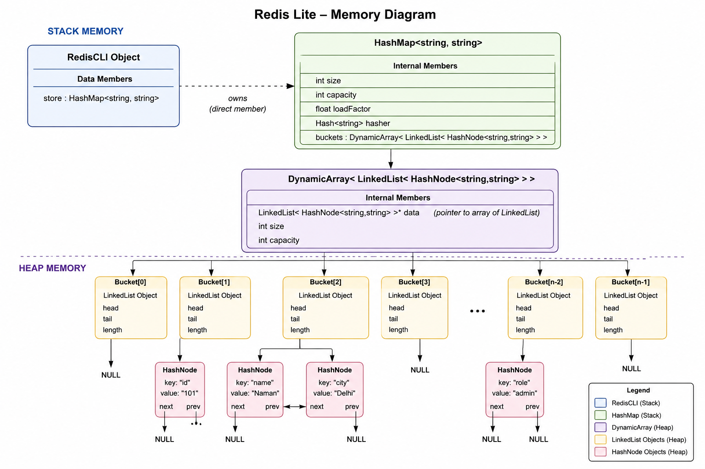

# Redis Lite 
Redis Lite is a simplified, in-memory key-value store inspired by Redis. It stores data as key-value pairs and provides fast retrieval by maintaining all data in main memory rather than on disk. The system is built entirely on the custom HashMap implementation developed in previous phases, allowing average-case constant-time operations for insertion, lookup, deletion, and existence checking.


## Section 1 : Public Api

1. ```run()``` : It starts the Redis Lite command-line interface. The function continuously accepts commands from the user, parses the input, and invokes the appropriate handler function until the user exits the application. Since it only manages the program execution flow, the return type is **void**. <br>

2. ```handleSet(string key, string value)``` : It takes a **key** and a **value** as input and stores the key-value pair in the HashMap. If the key already exists, its associated value is updated; otherwise, a new entry is inserted into the HashMap. Since the function performs the insertion internally, the return type is **void**. <br>

3. ```handleGet(string key)``` : It takes a **key** as input and searches for the corresponding value in the HashMap. If the key is found, the associated value is displayed; otherwise, an appropriate message is printed indicating that the key does not exist. As the function directly prints the result, the return type is **void**. <br>

4. ```handleDel(string key)``` : It takes a **key** as input and removes the corresponding key-value pair from the HashMap if it exists. If the key is not found, the user is informed accordingly. Since the deletion is performed internally without returning any value, the return type is **void**. <br>

5. ```handleExists(string key)``` : It takes a **key** as input and checks whether the key is present in the HashMap. Based on the result, it displays whether the key exists or not. Since the function outputs the result directly instead of returning it, the return type is **void**. <br>

6. ```handleCount()``` : It displays the total number of key-value pairs currently stored in the HashMap by calling its `size()` function. As the function simply prints the count and does not return it, the return type is **void**. <br>

7. ```handleClear()``` : It removes all key-value pairs from the HashMap, resetting the data store to an empty state. After successfully clearing the HashMap, it displays a confirmation message to the user. Since the operation is performed internally without returning any value, the return type is **void**. <br>

## Section 2 : Internal Representation



The **RedisCLI** class serves as the command-line interface for Redis Lite. It does not store key-value pairs directly; instead, it delegates all storage operations to an instance of the custom **HashMap** class. The HashMap acts as the underlying storage engine, maintaining all key-value pairs entirely in memory.

Whenever a user enters a command such as `SET`, `GET`, `DEL`, or `EXISTS`, the `RedisCLI` parses the command and invokes the corresponding member function of the `HashMap`. This separation of responsibilities keeps the command-processing logic independent from the storage mechanism.

Since Redis Lite is an in-memory key-value store, all data resides within the `HashMap` during program execution. Once the program terminates, the HashMap is destroyed and all stored data is lost.

### Internal Components

The `RedisCLI` class contains only one data member:

```cpp
HashMap<std::string, std::string> store;
```

- **store**: The primary in-memory database that stores all key-value pairs entered by the user.
- Keys are represented as strings.
- Values are represented as strings.
- All operations (`SET`, `GET`, `DEL`, `EXISTS`, and `COUNT`) are performed by invoking the corresponding operations provided by the `HashMap`.

The `RedisCLI` class itself does not manage dynamic memory. It relies entirely on the `HashMap` implementation, which internally manages bucket allocation, collision handling using separate chaining, and automatic rehashing when the load factor threshold is exceeded.

## Section 3 : Complexity Estimates

## Time Complexity Analysis

### 1. `run()`

- **Best Case:** **O(1)**  
  If the user immediately exits the application, the loop terminates after processing a single command.

- **Average Case:** **Depends on the commands executed.**  
  The function repeatedly accepts user input and delegates each command to its corresponding handler.

- **Worst Case:** **Unbounded**  
  The application continues running until the user explicitly exits.

**Reason:**  
The `run()` function serves as the command-processing loop. Its execution time depends entirely on the number and type of commands entered by the user.

---

### 2. `handleSet(string key, string value)`

- **Best Case:** **O(1)**  
  The computed bucket is empty and the key is inserted immediately.

- **Average Case:** **O(1)**  
  A good hash function distributes keys uniformly, allowing insertion or update in constant time.

- **Worst Case:** **O(N)**  
  All keys hash to the same bucket, requiring traversal of the entire linked list.

**Reason:**  
The operation delegates insertion to the underlying `HashMap::set()` function.

---

### 3. `handleGet(string key)`

- **Best Case:** **O(1)**  
  The required key is found immediately within its bucket.

- **Average Case:** **O(1)**  
  Uniform hashing ensures only a small number of nodes are searched.

- **Worst Case:** **O(N)**  
  Every element resides in the same bucket, requiring a complete traversal.

**Reason:**  
The operation performs a lookup using the `HashMap::get()` function.

---

### 4. `handleDel(string key)`

- **Best Case:** **O(1)**  
  The key is found at the beginning of the bucket.

- **Average Case:** **O(1)**  
  The element is located quickly due to uniform key distribution.

- **Worst Case:** **O(N)**  
  The key is located at the end of a long collision chain or is absent.

**Reason:**  
Deletion depends on locating the key within the appropriate bucket before removing it.

---

### 5. `handleExists(string key)`

- **Best Case:** **O(1)**  
  The key is found immediately.

- **Average Case:** **O(1)**  
  The hash function distributes keys uniformly across buckets.

- **Worst Case:** **O(N)**  
  Every element is stored in the same bucket.

**Reason:**  
The function internally calls `HashMap::exists()`.

---

### 6. `handleCount()`

- **Best Case:** **O(1)**

- **Average Case:** **O(1)**

- **Worst Case:** **O(1)**

**Reason:**  
The function simply retrieves and displays the current number of key-value pairs stored in the `HashMap`.

---

### 7. `handleClear()`

- **Best Case:** **O(N)**

- **Average Case:** **O(N)**

- **Worst Case:** **O(N)**

**Reason:**  
Every key-value pair stored in the `HashMap` must be removed, requiring traversal of all buckets and deletion of every node.

## Section 4 : Design Decision

# Design Decisions

---

## Decision 1 : Using a Custom HashMap as the Storage Engine

### Options Considered

1. Use `std::unordered_map` from the C++ Standard Library.
2. Implement a custom `HashMap`.

### Decision Taken

RedisLite uses the **custom `HashMap`** implementation as its storage engine.

### Reason

Although `std::unordered_map` provides an efficient key-value storage mechanism, the primary objective of the project is to design and validate custom data structures. Using the self-implemented `HashMap` allows RedisLite to serve as a real-world application that verifies the correctness, performance, and reusability of the data structure. This approach also eliminates dependence on STL containers while demonstrating how a hash table can be integrated into an application.

---

## Decision 2 : Separating Command Processing from Data Storage

### Options Considered

1. Implement all command logic and storage operations inside a single class.
2. Separate the command-line interface from the storage layer.

### Decision Taken

The **RedisCLI** class handles command parsing and execution, while the **HashMap** is responsible only for key-value storage.

### Reason

Separating responsibilities improves modularity and maintainability. The command-line interface focuses only on processing user input, whereas the storage layer manages data independently. This reduces coupling between components and allows either module to be modified or extended without affecting the other.

---

## Decision 3 : Command-Oriented Architecture

### Options Considered

1. Process all commands inside a single large function.
2. Implement a separate member function for each Redis command.

### Decision Taken

Each Redis command (`SET`, `GET`, `DEL`, etc.) is implemented as an **independent member function**.

### Reason

Keeping command implementations separate improves code readability and maintainability. It also simplifies debugging since each command contains only its own logic. Furthermore, adding future Redis commands requires implementing only a new handler without modifying existing command implementations.

---

## Decision 4 : Input Validation Before Execution

### Options Considered

1. Execute commands directly without validation.
2. Validate command syntax and arguments before execution.

### Decision Taken

All user input is **validated before performing any operation**.

### Reason

Invalid commands, empty keys, and missing arguments are detected before interacting with the storage layer. Early validation prevents undefined behavior, improves application reliability, and provides meaningful error messages to the user instead of allowing operations to fail unexpectedly.

---

## Decision 5 : Encapsulation Through Public Interfaces

### Options Considered

1. Allow RedisLite to access the internal implementation of the `HashMap`.
2. Restrict interaction to the public interface of the `HashMap`.

### Decision Taken

RedisLite communicates with the `HashMap` only through its **public methods** such as `set()`, `get()`, `remove()`, and `exists()`.

### Reason

Restricting access to the public interface preserves encapsulation and hides implementation details from the application layer. This reduces dependency on the internal structure of the `HashMap`, making future modifications easier while ensuring that all storage operations follow a well-defined interface.